# 游戏架构设计总览

> 题材：武侠 / 仙侠 / 中式，像素风 2D / 2.5D 俯视
> 核心玩法：单角色养成（学技能、读书、习武）
> 次要玩法：村庄经营（资源获取）
> 战斗：半即时回合制，1v1
> 定位：开放探索的武侠养成 + 据点经营，半即时回合制战斗；中式像素风

---

## 一、核心游戏循环（Core Loop）

设计一切模块时，都围绕这条主循环展开，避免堆砌无关系统：

```
探索世界 / 触发事件
   ↓
获取资源 · 功法 · 人脉（道具 / 关系 / 见闻）
   ↓
回据点养成（读书 / 修炼 / 经营村庄）
   ↓
变强（属性 / 功法 / 装备提升）
   ↓
挑战更强的对手与区域（战斗）
   ↓（推动时间流逝 → 寿命 / 世代）
回到探索
```

- **主循环**：探索 → 养成 → 战斗 → 变强（角色成长）
- **辅循环**：经营村庄 → 稳定产出资源 → 反哺养成（解决"养成燃料"来源）
- **时间轴**：仅"做事"（读书/锻造/跨区域移动等）消耗时间，时间推动寿命衰老与轮回转世（长线养成节奏）

---

## 二、模块架构图

```mermaid
graph TD
    A[游戏核心 Game Core] --> B[角色系统]
    A --> C[功法武学系统]
    A --> D[战斗系统]
    A --> E[技艺/生活技能系统]
    A --> F[道具系统]
    A --> G[世界与地图系统]
    A --> H[人物关系/社交系统]
    A --> I[村庄经营系统]
    A --> J[事件/剧情系统]
    A --> K[时间与回合系统]
    A --> L[系统层/Meta]

    B --> B1[基础属性]
    B --> B2[资质天赋]
    B --> B3[特性/心境]
    B --> B4[状态: 寿命/伤势/精力]

    C --> C1[内功心法]
    C --> C2[外功招式/绝学]
    C --> C3[品级与境界]
    C --> C4[五行相性]
    C --> C5[学习/修炼/突破]

    D --> D1[半即时时间轴]
    D --> D2[招式与前后摇]
    D --> D3[身法/距离/走位]
    D --> D4[架势/破绽/拆招]
    D --> D5[内息调息]
    D --> D6[战斗AI]

    E --> E1[读书学问]
    E --> E2[制造: 锻造/炼丹/制毒]
    E --> E3[采集]
    E --> E4[杂学: 琴棋书画/医卜]

    F --> F1[装备: 武器/防具/饰品]
    F --> F2[消耗品: 丹药/食物]
    F --> F3[材料]
    F --> F4[书籍/秘籍]
    F --> F5[背包/仓库]

    G --> G1[地图/区域]
    G --> G2[势力/门派]
    G --> G3[NPC分布]
    G --> G4[探索与移动]

    H --> H1[好感/恩怨]
    H --> H2[互动交流]
    H --> H3[拜师/收徒]
    H --> H4[婚姻/传承]

    I --> I1[建筑/建造]
    I --> I2[资源生产]
    I --> I3[村民/人口]
    I --> I4[科技/升级]

    J --> J1[主线剧情]
    J --> J2[随机事件/奇遇]
    J --> J3[任务系统]
    J --> J4[对话分支]

    K --> K1[时间推进 日/旬/月/年]
    K --> K2[行动力/精力]
    K --> K3[寿命与衰老]
    K --> K4[世代传承]

    L --> L1[存档/读档]
    L --> L2[UI/HUD]
    L --> L3[配置数据表]
    L --> L4[设置/引导]
```



---

## 三、主模块与子模块详解

### 1. 角色系统（Character）— **最核心**
养成的载体，决定一切数值的根。

| 子模块 | 说明 |
| --- | --- |
| 基础属性 | 生命、内力、悟性、机敏、根骨、定力等，决定养成上限与战斗强度 |
| 资质 / 天赋 | 五行相性、各类技艺资质（学得快慢），出生时随机/可成长 |
| 特性 / 心境 | 性格、品质、心魔，影响事件选择与数值修正 |
| 状态 | 寿命/年龄、伤势（部位伤）、精力/心情、疾病 |
| 成长曲线 | 属性如何随修炼、年龄、事件变化 |

### 2. 功法武学系统（Martial Arts）— **核心养成深度**
| 子模块 | 说明 |
| --- | --- |
| 内功心法 | 提供内力上限、回复、被动增益 |
| 外功招式 / 绝学 | 战斗中实际释放的招式，分流派 |
| 品级与境界 | 功法品阶、修炼层数、突破节点 |
| 五行相性 | 功法相性与角色资质匹配 → 修炼效率/威力 |
| 学习 / 修炼 / 突破 | 习得（秘籍/拜师）、日常修炼、瓶颈突破规则 |

### 3. 战斗系统（Combat）— 半即时回合制 1v1
| 子模块 | 说明 |
| --- | --- |
| 半即时时间轴 | 双方行动按"读条/出手速度"在时间轴上推进，非纯轮流 |
| 招式与前后摇 | 每招有施放耗时、硬直、冷却 |
| 身法 / 距离 / 走位 | 远近距离影响招式可用性（距离拉扯博弈） |
| 架势 / 破绽 / 拆招 | 攻防博弈核心：化解、格挡、抓破绽反击 |
| 内息 / 调息 | 内力消耗与战斗中恢复节奏 |
| 战斗 AI | 敌方出招决策（不同流派/性格 AI） |

### 4. 技艺 / 生活技能系统（Life Skills）
| 子模块 | 说明 |
| --- | --- |
| 读书学问 | 概念明确提到"读书"，提供悟性/知识/解锁 |
| 制造 | 锻造（武器防具）、炼丹（丹药）、制毒、调香等 |
| 采集 | 采药、挖矿、伐木 → 供给制造与村庄 |
| 杂学 | 琴棋书画、医术、卜算等（社交/事件/支线用途） |

### 5. 道具系统（Items）
| 子模块 | 说明 |
| --- | --- |
| 装备 | 武器、防具、饰品（属性加成 + 战斗影响） |
| 消耗品 | 丹药、食物（恢复/临时增益） |
| 材料 | 制造与经营的原料 |
| 书籍 / 秘籍 | 功法、技艺的载体（残页/全本） |
| 背包 / 仓库 | 容量、堆叠、据点存储 |

### 6. 世界与地图系统（World & Map）
| 子模块 | 说明 |
| --- | --- |
| 地图 / 区域 | 大地图 + 子场景（俯视像素），区域危险度 |
| 势力 / 门派 | 各门派立场、关系、可加入/敌对 |
| NPC 分布 | 重要人物、商人、可交互对象 |
| 探索与移动 | 行走、遇敌、地点发现、路程时间消耗 |

### 7. 人物关系 / 社交系统（Relationships）
| 子模块 | 说明 |
| --- | --- |
| 好感 / 恩怨 | 好感度、仇恨值，影响互动结果 |
| 互动交流 | 切磋、赠礼、谈话、结义 |
| 拜师 / 收徒 | 习得功法的重要途径；徒弟可参与经营/战斗 |
| 婚姻 / 传承 | 与世代系统衔接，后代继承资质 |

### 8. 村庄经营系统（Village）— **次要玩法**
| 子模块 | 说明 |
| --- | --- |
| 建筑 / 建造 | 各类建筑（住所、工坊、药圃、藏书阁…） |
| 资源生产 | 建筑产出资源，支撑养成与制造 |
| 村民 / 人口 | 招募 NPC、分配劳作 |
| 科技 / 升级 | 建筑升级、解锁更高产出与新功能 |

> 设计要点：村庄是"养成燃料工厂"，与主循环挂钩，避免做成独立放置玩法。

### 9. 事件 / 剧情系统（Events & Quests）
| 子模块 | 说明 |
| --- | --- |
| 主线剧情 | 长线目标（如复仇/寻宝/称雄） |
| 随机事件 / 奇遇 | 见闻奇遇式事件，提供高价值奖励与抉择 |
| 任务系统 | 委托、支线、目标追踪 |
| 对话分支 | 选项 → 数值/关系/剧情后果 |

### 10. 时间与回合系统（Time & Turn）— **底层节奏**
| 子模块 | 说明 |
| --- | --- |
| 时间推进 | 日/旬/月/年单位，行动消耗时间 |
| 行动力 / 精力 | 每个时间单位可做的事有限 |
| 寿命与衰老 | 年龄增长，属性随之变化 |
| 轮回转世 | 主角死亡后以同一器灵之魂转世，依神器碎片获加成（核心成长机制） |

### 11. 系统层 / Meta（System）
| 子模块 | 说明 |
| --- | --- |
| 存档 / 读档 | 长周期游戏必备 |
| UI / HUD | 角色面板、战斗界面、地图、村庄界面 |
| 配置数据表 | 属性/功法/道具/事件等数值的数据驱动配置 |
| 设置 / 引导 | 选项、新手引导 |

---

## 四、需要编写的设计文档清单

> 建议按优先级 P0 → P2 逐步产出。P0 是定义游戏骨架的核心文档，必须先写。

| 优先级 | 文档名 | 归属模块 | 主要内容 |
| --- | --- | --- | --- |
| P0 | `核心玩法与游戏循环.md` | 全局 | 一句话定位、核心循环、玩家动机、留存设计 |
| P0 | `人物属性设计.md` | 角色系统 | 属性定义、数值范围、计算公式、成长规则 |
| P0 | `资质与天赋设计.md` | 角色系统 | 五行相性、技艺资质、成长机制 |
| P0 | `功法武学设计.md` | 功法系统 | 功法分类、品级境界、相性、修炼/突破规则 |
| P0 | `战斗系统设计.md` | 战斗系统 | 半即时时间轴、招式数据结构、距离/架势/破绽、伤害公式、AI |
| P0 | `时间与回合系统设计.md` | 时间系统 | 时间单位、行动力、寿命、世代传承 |
| P1 | `道具与装备设计.md` | 道具系统 | 道具分类、装备词条、品质、堆叠规则 |
| P1 | `技艺与生活技能设计.md` | 技艺系统 | 读书/制造/采集/杂学的规则与产出 |
| P1 | `村庄与建筑设计.md` | 村庄系统 | 建筑列表、资源循环、人口、升级树 |
| P1 | `世界观与地图设计.md` | 世界系统 | 世界观设定、地图结构、势力门派、区域难度 |
| P1 | `人物关系与社交设计.md` | 社交系统 | 好感/恩怨规则、互动方式、拜师收徒、婚姻传承 |
| P2 | `事件与剧情设计.md` | 事件系统 | 主线大纲、奇遇模板、任务结构、对话分支格式 |
| P2 | `经济与交易设计.md` | 道具/村庄 | 货币体系、商店、价格、产销平衡 |
| P2 | `UI/UX 设计.md` | 系统层 | 各界面布局、交互流程、信息层级 |
| P2 | `数据表规范.md` | 系统层 | 配置表字段定义、命名规范、数据驱动方案 |
| P2 | `美术风格指南.md` | 全局 | 像素规格、调色板、角色/场景规范（中式像素风） |

---

## 五、建议的推进顺序

1. **先定骨架（P0）**：核心循环 → 人物属性 → 功法 → 战斗 → 时间系统。这五份决定了"游戏到底是什么"。
2. **再填血肉（P1）**：道具、技艺、村庄、世界、社交，让循环能跑起来。
3. **最后润色（P2）**：事件剧情、经济平衡、UI、数据规范、美术。

> 原则：每个系统都要能回答"它如何服务于核心循环"，凡是无法挂接到主循环的系统先砍掉，避免过度设计。
